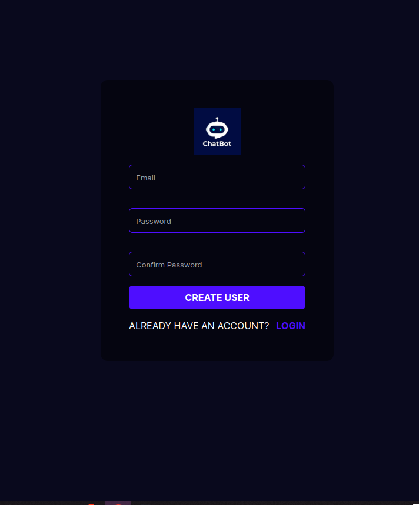
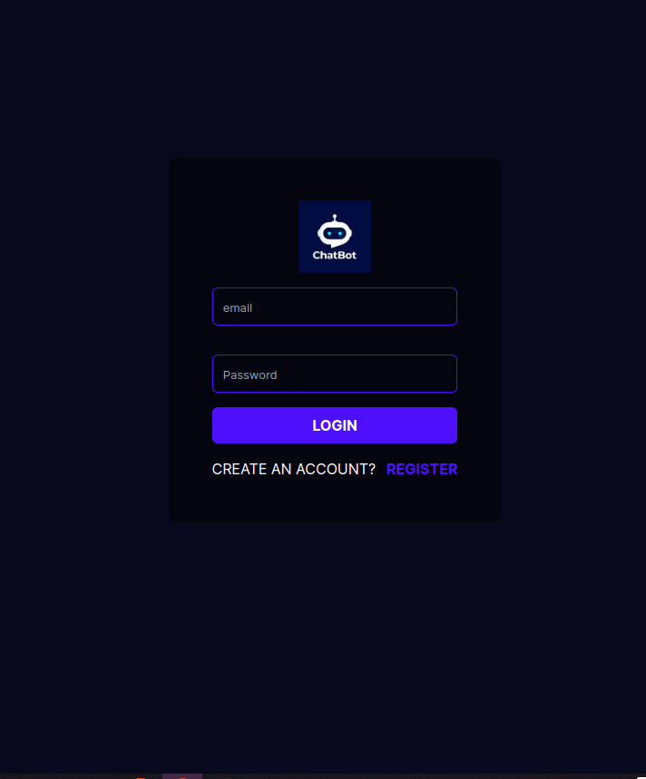
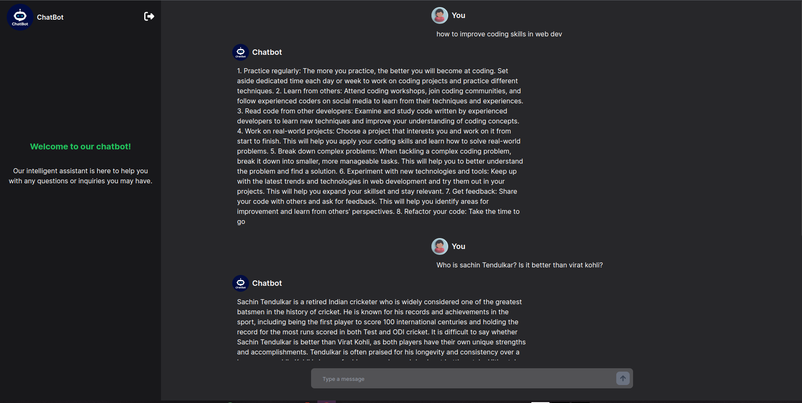

# AI Chatbot Application 
AI Chatbot is a sophisticated web application designed to provide intelligent and context-aware responses to user queries in real-time. Visit the <a href="https://durgeshbot.vercel.app/"> AI Chatbot</a> live application.
## Features
- Intelligent and context-aware responses
- Real-time interaction
- User-friendly interface

## Installation
1. **Clone the Repository**
   ```shell
   git clone https://github.com/durgeshmehar/Chatbot.git
   cd Chatbot
2. **Install Backend Dependencies**
 ```shell
cd chatbot_backend
pip install
uvicorn main:app --reload
```
3. **Configure Frontend URL**
-> Go to the file constant.js
```shell
cd Chatbot/chatbot_frontend/src/components/constant.js
```
-> Replace this line with your backend hosted URL.
```shell
export const BACKEND_URL ="YOUR_BACKEND_URL"
```
4. **Install Frontend Dependencies**
    ```shell
    cd chatbot_frontend
    npm install
   ```
5. **Run development server**
 ```shell
  npm run dev
 ```
Done! Now open localhost:3000 in your browser.
## Screenshots
### Live link: [here](https://durgeshbot.vercel.app/)
#### Signup page

#### Login page

#### Chat page


## Usage
1. Ensure both the backend and frontend servers are running.
2. Open your browser and navigate to http://localhost:3000 to access the AI Chatbot application.

## Contributing
Contributions are welcome! Please fork the repository and create a pull request with your changes.

## License
This project is licensed under the MIT License.
